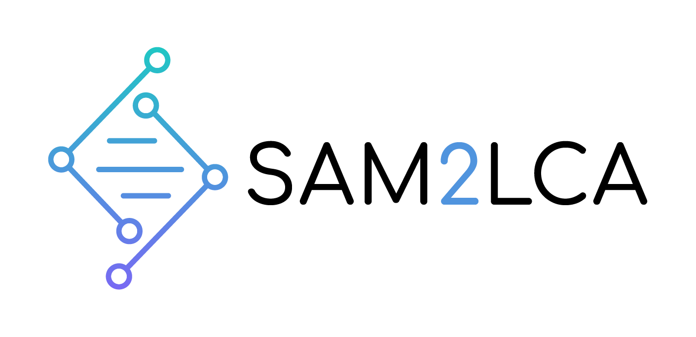

<p align="center">
    <a href="https://github.com/maxibor/sam2lca/actions"></a>
    <a href="https://sam2lca.readthedocs.io"></a>
    <a href="https://pypi.org/project/sam2lca"></a>
    <a href="https://anaconda.org/maxibor/sam2lca"></a>
</p>

# sam2lca

[Lowest Common Ancestor](https://en.wikipedia.org/wiki/Lowest_common_ancestor) from a [SAM/BAM/CRAM](https://en.wikipedia.org/wiki/SAM_(file_format)) sequence alignment file.

## TLDR

Analysis of sequencing reads aligned to a DNA database with NCBI accession numbers, using the NCBI taxonomy

```bash
sam2lca analyze myfile.bam
```

See all options

```bash
sam2lca --help
sam2lca update-db --help
sam2lca list-db --help
sam2lca analyze --help
```

> For further infos, check out the [sam2lca documentation](https://sam2lca.readthedocs.io) and [tutorial](https://sam2lca.readthedocs.io/en/latest/tutorial.html)

## Installation

### With [Conda](https://docs.conda.io/en/latest/) (recommended)

```bash
conda install -c conda-forge -c bioconda -c maxibor sam2lca
```

### With [pip](https://pypi.org/project/pip/)

```bash
pip install sam2lca
```

### For development purposes, from the dev branch

```bash
# clone repository 
git clone git@github.com:maxibor/sam2lca.git
# work on the dev branch
git checkout dev
# work in the sam2lca conda environment
conda env create -f environment.yml
conda activate sam2lca
# install sam2lca in editable mode
pip install -e .
# Run the unit and integration tests
pytest -s -vv --script-launch-mode=subprocess
```

or

```bash
pip install git+ssh://git@github.com/maxibor/sam2lca.git@dev
```

## Documentation

The documentation of sam2lca, including tutorials, is available here: [sam2lca.readthedocs.io](https://sam2lca.readthedocs.io)
