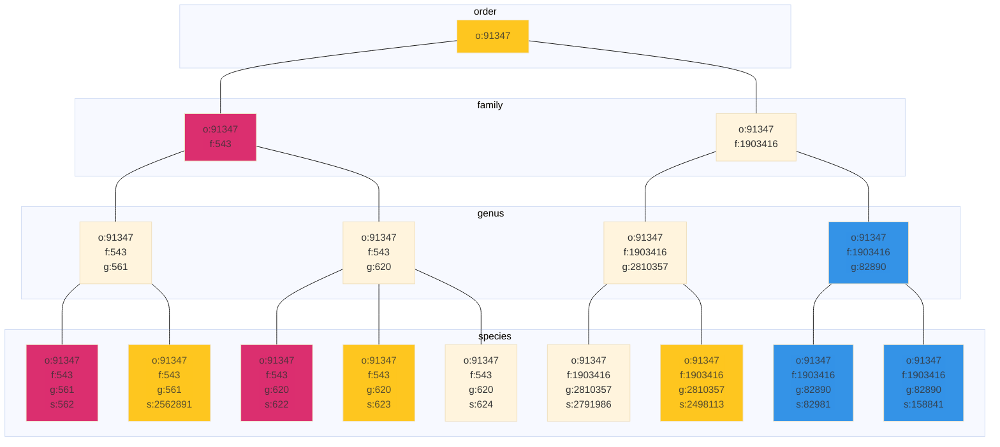

```mermaid
%%{init: {"theme": "base", "themeVariables": { "fontSize": "16px"}}}%%
flowchart BT
    subgraph species
        A[o:91347\nf:543\ng:561\ns:562]:::example_1
        B[o:91347\nf:543\ng:561\ns:2562891]:::example_3
        C[o:91347\nf:543\ng:620\ns:622]:::example_1
        D[o:91347\nf:543\ng:620\ns:623]:::example_3
        E[o:91347\nf:1903416\ng:2810357\ns:2791986]
        F[o:91347\nf:543\ng:620\ns:624]
        G[o:91347\nf:1903416\ng:2810357\ns:2498113]:::example_3
        H[o:91347\nf:1903416\ng:82890\ns:82981]:::example_2
        I[o:91347\nf:1903416\ng:82890\ns:158841]:::example_2
    end
    subgraph genus
        J[o:91347\nf:543\ng:561]
        K[o:91347\nf:543\ng:620]
        L[o:91347\nf:1903416\ng:2810357]
        M[o:91347\nf:1903416\ng:82890]:::example_2
    end
    subgraph family
        N[o:91347\nf:543]:::example_1
        O[o:91347\nf:1903416]
    end
    subgraph order
        P[o:91347]:::example_3
    end   
    A --- J
    B --- J
    C --- K
    D --- K
    E --- L
    F --- K
    G --- L
    H --- M
    I --- M
    J --- N
    K --- N
    L --- O
    M --- O
    N --- P
    O --- P

    classDef example_1 fill:#D81A60,opacity:0.9;
    classDef example_2 fill:#1F88E5,opacity:0.9;
    classDef example_3 fill:#FFC107,opacity:0.9;
```
